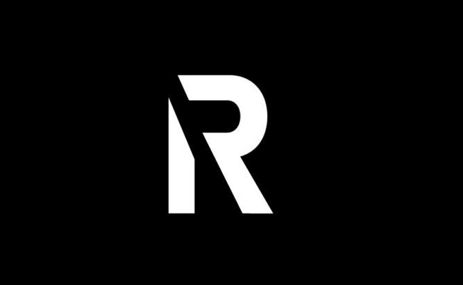

Portfólio Pessoal

Este repositório contém o código fonte do meu portfólio pessoal. A página foi desenvolvida utilizando HTML e CSS, e apresenta minhas informações de contato e links para minhas redes sociais.

Estrutura do Código HTML

Descrição do Código HTML

Cabeçalho do Documento HTML:

    <!DOCTYPE html>: Define o tipo de documento como HTML5.
  
    <html lang="en">: Define o idioma da página como inglês.
    <head>: Contém metadados sobre o documento.
      <meta charset="UTF-8">: Define a codificação de caracteres como UTF-8.
      <meta name="viewport" content="width=device-width, initial-scale=1.0">: Configura a visualização para dispositivos móveis.
      <title>Portifolio</title>: Define o título da página que aparece na aba do navegador.
      <link rel="stylesheet" href="style.css">: Linka um arquivo CSS externo chamado "style.css" para estilizar a página.

Estrutura do Código HTML

Corpo do Documento HTML:

Descrição do Código HTML

    <body>: Contém todo o conteúdo visível da página.
    <main>: Contém o conteúdo principal da página.
      
: Div que contém o texto principal da apresentação.
        <h1>Redes Sociais de <strong>Renan Cristian</strong></h1>: Cabeçalho que apresenta as redes sociais de Renan Cristian com o nome em negrito.
        
...
: Parágrafo que descreve Renan Cristian, sua formação e conhecimentos.
    
      
: Div que contém os botões para redes sociais.
        Cada <a> é um link para uma rede social diferente (LinkedIn, Instagram, GitHub, YouTube) com um botão dentro (<input type="button" value="Nome da Rede Social">).
    
      
: Div que contém a imagem do logo.
        : Imagem do logo com texto alternativo "Logo R".
